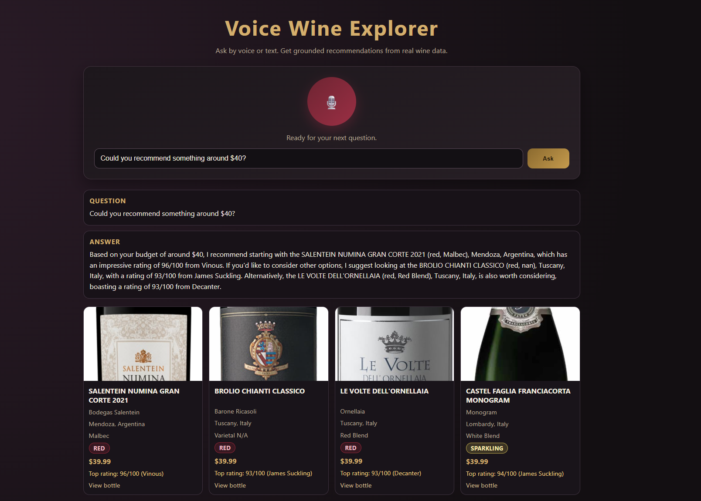

# Voice Wine Explorer

A voice-enabled web app that lets you ask questions about a wine catalog and get answers in both text and spoken voice. Built with FastAPI, LangChain, and the Web Speech API.



---

## Features

- **Voice input** — click the mic button and ask your question out loud
- **Voice output** — answers are read aloud via the browser's Speech Synthesis API
- **LLM-powered query planning** — uses an LLM to parse intent, extract filters (color, region, country, varietal, price), and choose sort order before querying the dataset
- **Grounded answers** — responses are strictly based on the provided wine CSV; the model is instructed never to invent wines
- **Graceful fallback** — if the LLM is unavailable, a heuristic filter still returns relevant results
- **Wine cards** — matched wines are displayed with name, producer, region, varietal, price, rating, and bottle image

---

## Tech Stack

| Layer | Technology |
|---|---|
| Backend | Python, FastAPI, LangChain |
| LLM | OpenAI (`gpt-4o-mini`) or local Ollama |
| Data | Pandas (CSV) |
| Frontend | Vanilla HTML/CSS/JS |
| Voice | Web Speech API (SpeechRecognition + SpeechSynthesis) |

---

## Getting Started

### 1. Clone the repo

```bash
git clone https://github.com/ton198/voice-wine-explorer.git
cd voice-wine-explorer
```

### 2. Install dependencies

```bash
pip install -r requirements.txt
```

### 3. Configure environment

```bash
cp .env.example .env
```

Open `.env` and fill in your settings:

```env
# Use OpenAI (easiest for reviewers — no local setup needed)
LLM_PROVIDER=openai
OPENAI_API_KEY=sk-...
OPENAI_MODEL=gpt-4o-mini

# Or use local Ollama
# LLM_PROVIDER=ollama
# OLLAMA_MODEL=llama3.1:8b
```

### 4. Run the server

```bash
uvicorn main:app --reload
```

Then open [http://localhost:8000](http://localhost:8000) in your browser.

> **Note:** Voice input requires a browser that supports the Web Speech API (Chrome recommended). The text input always works as a fallback.

---

## Example Questions

- *Which are the best-rated wines under $50?*
- *What do you have from Burgundy?*
- *What's the most expensive bottle you have?*
- *Which bottles would make a good housewarming gift?*
- *Recommend a red wine from Argentina under $30.*
- *Do you have any sparkling wines?*

---

## Project Structure

```
voice-wine-explorer/
├── app/
│   ├── api.py           # FastAPI routes
│   ├── assistant.py     # Orchestrates LLM + filtering + response
│   ├── query_engine.py  # LLM query plan generation + heuristic filter
│   ├── repository.py    # Loads and queries the wine CSV
│   ├── llm_client.py    # LLM client factory (OpenAI / Ollama)
│   ├── config.py        # All env vars and constants
│   └── schemas.py       # Pydantic request/response models
├── static/
│   ├── css/styles.css
│   └── js/app.js        # Voice input/output + API calls
├── index.html           # Single-page UI
├── wines.csv            # Wine dataset
├── main.py              # Entrypoint
├── requirements.txt
└── .env.example
```

---

## Design Decisions

**Two-layer query pipeline:** The app first asks the LLM to produce a structured query plan (filters, sort order, limit) as JSON. If the LLM call fails or returns invalid JSON, it falls back to a fast regex + keyword heuristic. This means the app degrades gracefully rather than crashing.

**No hallucination:** The LLM only sees wines that survived the filter step. The system prompt explicitly instructs it to use exact wine names from the provided list and never invent facts.

**Voice as a first-class citizen:** Voice input auto-submits on transcript completion. Voice output fires immediately after the answer renders. Both are opt-in and fall back silently if the browser doesn't support them.

---

## Requirements

- Python 3.11+
- An OpenAI API key **or** a local [Ollama](https://ollama.com) instance
- A modern browser (Chrome recommended for voice features)
